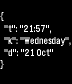
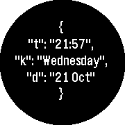

# jsonface

A geeky Pebble watchface that looks like a JSON document.

  

[Get it here!](http://apps.getpebble.com/en_US/application/562334aebdf1bf8d58000036)

Uses [pbcpp](https://github.com/ejball/pbcpp), a C++ library for writing Pebble watchfaces and apps.
